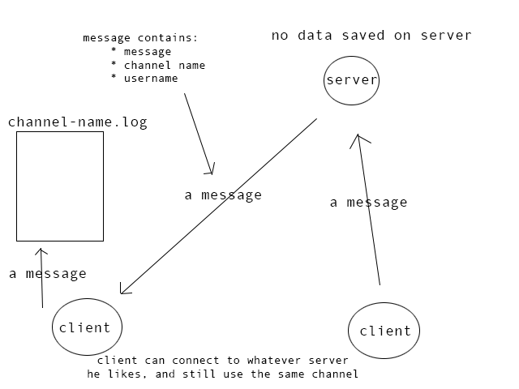

# calledio
> A chat service where you own your data.  
> No data is stored on a calledio-server.

## installation
> create your config file:

    cp config.example.json config.json

> Edit the `config.json` file...

> run:

    python setup.py install

## Running a server:

    calledio-server

## Running a client:

    calledio-client --channel=flowers --username=stallman

## Where are all messages stored?
> You specify in the `config.json` where to store messages / channels.  
> if you have sent a message to the channel `general` for example,  
> then those messages will be stored in `$directory/general.log`

> To view your messages _live_, you could do:

    tail -f $directory/general.log

## Custom message store
> Want to integrate calledio in your own application?
> You can create your own method for storing messages by doing:
    from calledio.storage import Storage

     
    def my_append(channel, text):
        # save somewhere
        # channel = channel name
        # text = the line that should be saved somewhere

        save_to_awesome_database(channel, text) # whatever
    
    storage = Storage(host, port)
    storage._append = my_append

    storage.start() # starting the client
